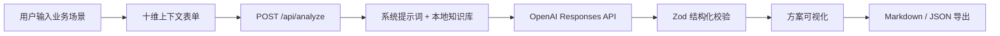

# 业务场景拆解 Agent

一个面向企业项目立项与方案设计的业务场景拆解 Agent。它负责理解业务、拆解任务并判断哪些部分适合 RPA、AI、API、规则、Python/SQL、工作流或人工；不会为了展示 Agent 而把客户场景强行设计成 Agent。当前版本只输出分析方案，不连接真实客户系统，也不直接执行高风险动作。

## 功能

- 单场景深挖、业务域盘点、企业机会规划三种分析范围；快速、标准、深度三档分析深度
- 从部门、业务域或企业目标识别多个候选场景，输出价值/可行性/风险优先级组合
- 十维业务上下文、L1–L5 五层拆解、端到端数据闭环
- 当前问题、目标流程、技术映射、Agent 必要性与风险治理
- 分阶段实施路线图和 100 分制价值评估
- OpenAI Responses API + Zod 结构化输出；无密钥自动启用行业感知 Mock（客服、HR、合同、销售、采购、制造、医疗等）
- 复制 Markdown、下载 Markdown、下载 JSON
- 独立模型配置页面；用户可按浏览器会话配置 API Key 与模型，不回显、不落盘
- 空、加载、错误、Mock 四种界面状态；不持久化用户输入

## 架构



Next.js App Router 负责页面和服务端 Route Handler；所有模型调用只发生在服务端。`knowledge/` 的五份知识文件在请求时读取并拼入提示词，模型结果经严格 Schema 二次校验后返回前端。

## 本地运行

需要 Node.js 20.9 或更高版本。

```bash
npm install
copy .env.example .env.local   # Windows；macOS/Linux 使用 cp
npm run dev
```

打开 `http://localhost:3000`。默认 `USE_MOCK_ANALYSIS=true`，无需密钥即可填写任意场景并完成全流程演示。Mock 会根据关键词与用户填写的信息选择行业模板；它用于产品体验与结构演示，不等同于大模型推理。需要对任意细分行业做深入定制时，请配置 OpenAI Key 并切换实时分析。

## 环境配置

```env
OPENAI_API_KEY=
OPENAI_MODEL=gpt-5.4-mini
USE_MOCK_ANALYSIS=true
```

- `OPENAI_API_KEY`：仅服务端读取；不要提交真实密钥。
- `OPENAI_MODEL`：可覆盖服务端默认轻量推理模型。
- `USE_MOCK_ANALYSIS`：设为 `true` 强制演示模式；未配置 Key 时也会自动 Mock。正式调用需设为 `false` 并配置 Key。

也可在页面右上角进入“模型配置”，为当前浏览器会话临时设置 API Key。会话 Key 只保存在服务端内存中，最长 12 小时且服务重启即失效；它不会写入浏览器存储、日志或项目文件。远程部署必须使用 HTTPS。

## 质量检查

```bash
npm run typecheck
npm run lint
npm run test
npm run build
```

## 部署建议与数据安全

可部署到支持 Next.js Node.js Runtime 的平台。环境变量使用平台密钥管理，不进入前端 bundle。建议在生产环境增加请求大小限制、访问控制、速率限制和企业出口代理。本应用不使用数据库，不保存表单输入；页面刷新后数据清空，导出只由用户主动触发。服务端不记录完整输入、完整模型响应或密钥。

## 当前限制与演进

当前版本不含登录、历史记录、客户知识库上传和真实系统写入。后续可按治理成熟度逐步增加知识库上传、真实系统 API、受控 RPA 工具、审批流、行业项目模板、多租户与细粒度权限；在数据和治理闭环建立之前，不应扩大 Agent 的写权限。
